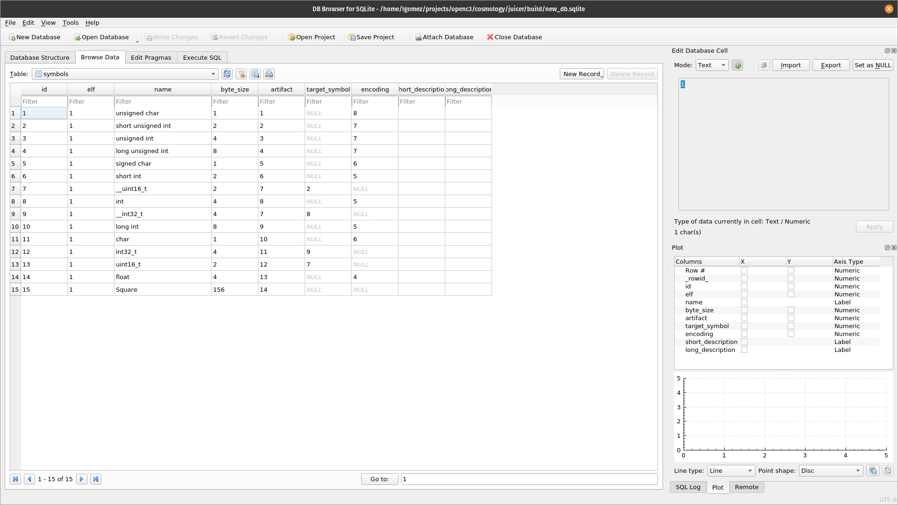
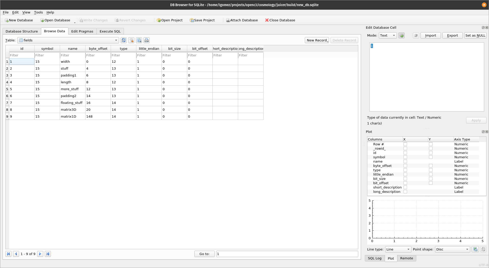

[](https://github.com/WindhoverLabs/juicer/actions/workflows/ci.yaml)
[](https://coveralls.io/github/WindhoverLabs/juicer?branch=unit_test_updates)

# Table of Contents
1. [Dependencies](#dependencies)
2. [Building it](#building_it)
3. [What is it?](#what_is_it)
4. [GCC Compatibility](#compatibility)
5. [Padding](#padding)
6. [Environment Setup](#environment-setup)
7. [Testing](#testing)
8. [DWARF Support](#dwarf_support)
9. [Notes on Macros](#notes_on_macros)
10. [Extra Elf Features](#extra_elf_features)
11. [vxWorks Support](#vxWorks)
12. [Notes On Multiple DWARF Versions](#multiple_dwarf_versions)
13. [Bitfields](#Bitfields)
14. [Docker Dev Environments](#docker_dev_env) 

## Dependencies <a name="dependencies"></a>
* `libdwarf-dev`
* `libelf-dev`
* `libsqlite3-dev`
* `C++14`
* `Catch2`
* `g++>=5.4.0`
* `gcovr`
* `libarchive-zip-perl` (Needed for unit test verification of crc32)


## Building it <a name="building_it"></a>

1. Clone the repo
```
git clone https://github.com/WindhoverLabs/juicer.git
cd juicer
```

2. Update the git submodules:

```
git submodule update --init
```

3. Right now the working branch is `develop`, so switch to it
```
git checkout develop
```
4. Our build system has a few build recipes. If all you want is to get jucier up and running,

```
make
```
This will build the executable for you, which you'll find on `build/juicer`.


If you would like to run unit tests, you can do that too:

```
make run-tests
```

**NOTE:** Make sure you have all the dependencies mentioned above. If you are missing any of those dependencies, juicer will *not* build. 


## What is it? <a name="what_is_it"></a>
juicer extracts structs, arrays, enumerations, macros and intrinsic types(support for everything else is planned for the future, but it is not a priority at the moment) from executable elf files and stores them in a SQLite database.

### An Example
Imagine we wrote some elf_file.cpp that looks like this.
```
#include "stdint.h"

#define ARRAY_1D_SIZE 2

typedef struct
{
    int32_t width = 101;
    uint16_t stuff;
    uint16_t padding1;
    int32_t length;
    uint16_t more_stuff;
    uint16_t padding2;
    float       floating_stuff;
    float       matrix3D[ARRAY_1D_SIZE][4][4];
    float       matrix1D[ARRAY_1D_SIZE];
}Square;

Square sq = {};
```

`juicer` uses DWARF debug information to extract all the information. Because of this, you *must* pass the `-g` flag to `gcc` when compiling your source code:

```
g++ -std=c++14  elf_file.cpp -g -c -o elf_file
```

To include macros in the output, make sure to pass "-g3" when compiling:


```
g++ -std=c++14  elf_file.cpp -g -g3 -c -o elf_file
```
NOTE:Please beware that compiler switchess may have different names for different compilers. 
Here we use gcc as an example since it is a compiler that is accessible to most teams.

Assuming you've built juicer successfully, you can give this binary file to juicer:

```
./build/juicer --input path_to_file --mode SQLITE --output build/new_db.sqlite -v4

```

This tells juicer to squeeze and extract as much as possible out of the binary at path_to_file and write all of that data to the `sqlite` database at build/new_db.sqlite. `v4` is for verbosity level 4, which is the highest level and will output every message from the log. 

After juicer is done, you will find a database populated with data about our binary file at `build/new_db.sqlite`.  The database should have the following schemas:

"*" = PRIMARY KEY  
"+" = FOREIGN KEY

### elfs
| id* | name  | md5     | date | little_endian | short_description | long_description |
| --- | --- |---------| --- | --- | -- | -- |
|INTEGER | TEXT | INTEGER | DATETIME | BOOLEAN | TEXT | TEXT |

###  enumerations
| symbol* | value* | name | short_description | long_description |
| --- | --- | --- | -- | -- |
| INTEGER | INTEGER | TEXT | TEXT | TEXT |

### fields
| id* | name | symbol+ | byte_offset | type+ | little_endian | bit_size | bit_offset |
| --- | --- | --- | --- | --- | --- | --- | --- |
| INTEGER | TEXT | INTEGER |INTEGER | INTEGER | BOOLEAN | INTEGER | INTEGER |

### dimension_lists
| id* | field_id+ | dim_order | upper_bound |
| ---| --- | --- | --- |
| INTEGER | INTEGER | TEXT | INTEGER 

### symbols
| id* | elf+ | name | byte_size | artifact* | target_symbol* | encoding* | short_description | long_descriptions |    
| ---| --- | --- | --- |-----------|----------------|-----------|------|------|
| INTEGER | INTEGER | TEXT | INTEGER | INTEGER | INTEGER | INTEGER | TEXT | TEXT |

In our specific example, the **symbols** and **fields** tables are the ones we are interested in. 

**NOTE**: Notice the `bit_size` and `bit_offset` columns in the fields table; these values are used for struct members that are bit-packed. When the fields are not bit-packed, bit_size and bit_offset are set to 0.



As you can see in the image above, our `Square` struct that we defined in our source file is in row 15!

You might ask where are its members...that's what the **fields** table is for.



As you can see we have a few fields that match our Square struct's id, which is 15. Those fields belong to our struct `Square`. Also note the **type** column; this tells us the particular type a field is. 

What about our matrix arrays such as `matrix3D` and `matrix1D`? That's what the **dimension_lists** table is for.


Notice how the three records in dimension_lists have a `field_id` of `8`. If we look at our fields table we notice that
`matrix3D` has an id of `8` as well. The dimension_lists tells us that field with id `8` is 3 dimensional array; the first
dimension has an upper bound of 1(inclusive; size 2); the second one(which has dim_order of 1) is 3; the third one has
an upper bound of 3. These are the dimensions of `matrix3D`. This design is modeled after the DWARF4 and XTCE standards. Hopefully this schema is clear enough.

This is how juicer stores data in the database.

**NOTE**: Beware that it is absolutely fine to run juicer multiple times  on different binary files but on the *same* database. In fact juicer has been designed with this mind so that users can run juicer multiple times against any code base, no matter how large in size.


# GCC Compatibility <a name="compatibility"></a>

Since`juicer` is reading ELF files, the compiler one uses or the specific linux version *can* affect the behavior of the libelf libraries.
Because of this we have tested `juicer` (and continuously test in CI)on the specified platforms in the table below.

| Ubuntu Version | GCC Version(s)  | DWARF Version | 
|---|---| ---|
| `Ubuntu 18.04.1 LTS`  |   `7.5.0`     | 4 |
| `Ubuntu 20.04.1 LTS`  |   `9.4.0`     | 4 |
| `Ubuntu 22.04.5 LTS`  |   `11.4.0`    | 5 |


# Padding <a name="padding"></a>
Different compilers and sometimes programmers insert padding into C Structures. Padding in the database is captured by `juicer` as well. Padding fields will have a name in the "_spare[N]" fashion in the database. N is for distinguishing different fields. For exampe a struct that has three fields of padding will have `_spare0`, `_spare1` and `_spare2`. Padding that is inserted at the end of the struct has a field with the name of `_padding_end`. Hopefully this naming scheme makes sense. 

## Padding Types
When `juicer` finds padding, a new type is created for the number of bytes of padding that are found. For instance, if there is 3 bytes of padding then a type `_padding24` will be created. The `24` is the size of the padding in bits. Please note that if more padding is found elsewhere and the number of bytes is 3, then the `_padding24` type will be used for that field to avoid over-populating the database with unnecessary data.


# Environment Setup <a name="environment-setup"></a>

Most of this project is written in C++14, with some parts in C because of libraries like `sqlite3` and `libdwarf`.

* Eclipse CDT 9.7.0.201903092251
* C++14
* Ubuntu 16.04.6 LTS

We currently use Eclipse to maintain this project and we are trying to not make that a painful dependency that
developers have to deal with. This is why the Eclipse project is under `juicer/juicer`. We know it's not the best
solution, but we'll try to make this a little more modular in the future to be usable in other IDEs and environments. 
For now, if you want to get started on Juicer, your best bet is using Eclipse. Hopefully we'll find a more modular non-Eclipse way of doing this.

## Debugging in Eclipse

By default this version of Eclipse uses `gdb 7.11.1`, but this version does not have support for inspecting smart pointers. You need to setup `lldb`, llvm's debugger.

 
### Setting up lldb on  Eclipse

1. `sudo apt-get install lldb`
2. Now on Elcipse go to **Help->Install New Software...** and Install LLDB Debugger


3. Then right-click on your project and go to **Juicer->Debug As->Debug Configurations**
4. Click on the **select other...** option at the bottom of the window


5. Set `LLDB` as your default debugger


  
  And you are all set!

## Debugging libdwarf
 Sometimes it is often useful to be able to step through code inside of libdwarf, which juicer heavily depends on.
 This can be done by installing `libdwarf1-dbgsym` with the following commands:
  ```
  sudo apt install ubuntu-dbgsym-keyring
  echo "deb http://ddebs.ubuntu.com $(lsb_release -cs) main restricted universe multiverse
  deb http://ddebs.ubuntu.com $(lsb_release -cs)-updates main restricted universe multiverse
  deb http://ddebs.ubuntu.com $(lsb_release -cs)-proposed main restricted universe multiverse" | \
  sudo tee -a /etc/apt/sources.list.d/ddebs.list
  sudo apt-get install libdwarf1-dbgsym
  ```

  
## Testing <a name="testing"></a>
We currently use the [Catch2](https://github.com/catchorg/Catch2) framework for our Unit testing. It is integrated into the repo as a submodule. You can find
all of our testing under the `Testing` folder. Just like Juicer, it is an Eclipse project. So, if you already use Eclipse, 
then just import the project and you can test away!

### Writing Unit Tests

`Catch2` allows to easily write very readable tests that are very easy to maintain and write. Below is an example of this
that tests the correctness of an ElfFile's name on `Testing/TestElfFile.cpp`:

	#include "catch.hpp"
	#include "ElfFile.h"
	
	TEST_CASE("Test name correctness", "[ElfFile]")
	{
	    ElfFile elffy{};
	    std::string elffyName{"elffy.o"};
	    elffy.setName(elffyName);
	
	    REQUIRE(elffy.getName() == elffyName);
	}
	
This test called "Test name correctness" will construct a very simple ElfFile object and check that when we set a name with `setName` we get the same exact name back when we call `getName`. The `REQUIRE` macro is the actual assertion that verifies this. If the test fails(meaning the `REQUIRE` macro is false), then our test and any other tests that follow stop executing. Catch2 has more interesting features like `CHECK` and syntax like `WHEN` for behavior-driven development that
you can read all about in the link above.
	
Note that we don't define a `main` function here so we define one very easily in `Testing/main.cpp`:

	/*This tells Catch to provide a main() - only do this in one cpp file*/
	#define CATCH_CONFIG_MAIN
	
	
	/**This disables coloring output so that Eclipse CDT(Version: 9.7.0.201903092251)
	 *will be able to render it. If you really like colored output, you'll have to use
	 *something else other than Eclipse's console(such as GNOME shell) to run the tests
	 *and comment out the CATCH_CONFIG_COLOUR_NONE macro.
	 */
	#define CATCH_CONFIG_COLOUR_NONE
	
	#include "catch.hpp"
	
Yes, that's it! Catch2 will read the `CATCH_CONFIG_MAIN` and generate a `main` function for you. The `CATCH_CONFIG_COLOUR_NONE` is not necessary to run Catch2, but if you run into problems where the output will not render properly because it is colored(like in Eclipse), then you might find this macro useful. 


Now all you have to do is build your project on Eclipse(or from the terminal) and then run all of your tests.

You can run your tests like this:
```
make run-tests
```
To run a specific test:
```
cd build
./juicer-ut "[ElfFile]"
```
Notice the tag "[ElfFile]" which was defined for the test case above.

### Generating Coverage Report

```
make coverage
```

This will run all unit tests on juicer and generate a test coverage report for you. After `make` is done, the test coverage report can be found on `build/coverage/index.html`.

## Dwarf Support <a name="dwarf_support"></a>
At the moment `juicer` follows the DWARF4 and DWARF5 specifications. If this changes, then this document will be updated accordingly.

As juicer evolves, dwarf support will grow and evolve as well. At the moment, we don't adhere to a particular DWARF version as we add support to the things that we need for our code base, which is airliner. In other words, we *mostly* support `C` code, or `C++` code without any cutting edge/modern features. For example, modern features such as `templates` or `namespaces` are not supported. If juicer finds these things in your elf files, it will simply ignore them. To have a more concrete idea of what we *do* support in the DWARF, take a look at the table below which records all DWARF tags we support.

### Dwarf Tags
| Name                  | Description |
|-----------------------| --- |
| DW_TAG_base_type      | This is the tag that represents intrinsic types such as `int` and `char`. |
| DW_TAG_typedef        | This is the tag that represents anything that is typdef'd in code such as   `typedef struct{...}` `typedef int16 my_int`. This is what the "target_symbol" column is for in the symbols table. |
| DW_TAG_structure_type | This is the tag that represents structs such as  `struct Square{ int width; int length; };` |
| DW_TAG_array_type     | This is the tag that represents *statically* allocated arrays such as `int flat_array[] = {1,2,3,4,5,6};`. Noe that this does not include dynamic arrays such as those allocated by malloc or new calls.|
| DW_TAG_pointer_type   | This is the tag that represents pointers in code such as `int* ptr = nullptr`|
| DW_TAG_enumeration_type | This is the tag that represents enumerations such as `enum Color{RED,BLUE,YELLOW};` |
| DW_TAG_const_type     | This is the tag that represents C/C++ const qualified type such as `sizetype`, which is used by containers(like std::vector) in the STL C++ library.  |
|  DW_MACRO_define      | This tag represents define macros such as "#define CFE_MISSION_ES_PERF_MAX_IDS 128"|
| DW_AT_decl_file       | This tag represents the file where a certain symbol is declared. Very useful for traceability of source code.|
| DW_AT_encoding | The encoding of base type. For example; "unsigned int" will have encoding "DW_ATE_unsigned". This is what the "encodings" table is for in the SQLITE db.|

For more details on the DWARF debugging format, go on [here](http://www.dwarfstd.org/doc/DWARF4.pdf).

### `void*`

DWARF version 4 and 5 has this to say about void pointers:

> The interpretation of this debugging information entry is intentionally left flexible to allow it to
be interpreted appropriately in different languages. For example, in C and C++ the language
implementation can provide an unspecified type entry with the name “void” which can be
referenced by the type attribute of pointer types and typedef declarations for 'void' (see Sections
0 and 5.3, respectively)
> -- <cite>Section 5.2 of DWARF4 </cite>

juicer behaves accordingly. If a pointer does not have a type(meaning it does not have a DW_AT_type attribute), then it is assumed that the pointer in question is of the `void*` type.


## Notes On #define Macros <a name="notes_on_macros"></a>
During testing we found that some pattern causes the macro being defined to "disappear" from the DWARF section:

When this happens, it is most likely a case of the macro being on a seperate group number inside of the DWARF.

To ensure juicer queries all macros, users can pass the "group number" via the "-g" flag. 

For example the command:
```
./juicer -g 5 --input elf_file --mode SQLITE --output build/new_db.sqlite -v4
```

tells juicer to get macros from group "5". The default is group "0", which is enough for most cases.

This seems to happen on unlinked compiled ELF files that have the following define pattern where there is an #include between #define(s):
```C
#define MAC1 2
#define MAC2 3
#include "macro_test.h"
#define MAC3 4
```

This is rare(especially unlinked files), but it does happen. In any case "-g" flag can be used to query macros (or any other DWARF data)
from as many groups(starting at 0) as the the ELF file has.

For more details on this issue and other macro issues:https://github.com/WindhoverLabs/juicer/issues/35


## Extra ELF Features <a name="extra_elf_features"></a>

jucier's main focus is to extract DWARF, however, it can extract ELF sections too. To extract elf sections pass the extras "-x" flag:

```
./juicer -x --input elf_file --mode SQLITE --output build/new_db.sqlite -v4
```

This can be useful for extracting data from object files such as static variables that are assigned at build time and whose
contents are stored in the elf symbols table. For an example of this see the "query_symbols.py"  script under this repo.

To learn more about the different ELF sections and how they're structured, there is a copy of the ELF standard under the docs directory on the repo.


## VxWorks Support <a name="vxWorks"></a>
At the moment vxWorks support is a work in progress. Support is currently *not* tested, so at the moment it is on its own [branch]
(https://github.com/WindhoverLabs/juicer/tree/vxWorks).


# Print Backtrace even after a segfault

```
catchsegv ./juicer-ut "[main_test#3]"
addr2line -e ./juicer-ut 0x19646c

```


## Notes On Multiple DWARF Versions <a name="multiple_dwarf_versions"></a>
- At the time of writing, juicer has been tested on DWARF4 and DWARF5.
- Do *not* use DWARF experimental support from your compiler. Use the *default* DWARF version, whether that is 5 or 4. When using a
DWARF version that still is experimental for your compiler, it is not guaranteed juicer will parse the binary correctly.


# Bitfields <a name="bitfields"></a>

For a bit-packed struct
```
struct S
{
    uint8_t before;
    int     j : 5;
    int     k : 6;
    int     m : 5;
    uint8_t p;
    int     n : 8;
    uint8_t after;
};
```

The fields table looks like this:


Notice for the bitpacked fields(j,k,m,n) the bit_offset and bit_size columns are nonzero.


# Docker Dev Environment <a name="docker_dev_env"></a>

It is often useful to use a virtualized environment for development. There are several recipes on this repo that make this easier.
For example `make docker-ubuntu22-build-dev` will start a dev environment inside of Docker with Ubuntu22. 
The repo is mounted as a volume under "/home/docker/juicer" so developers can make their changes on the host and build inside the container.


Documentation updated on September 19, 204